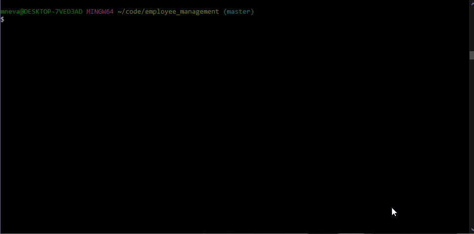

# Employee Management

### Table of Contents:
* [Description](##-Description)
* [Installation](##-Installation)
* [Demonstration](##-Demonstration)
* [Credits](##-Credits)
* [License](##-License)

## Description
This program if for those hiring managers, team leads and anyone who does employee intake. In just a few steps you can see all your departments, roles and employees you currently have. Also, you will be able to add an employee, a role or department along with updating an employee.  

## Installation
For this program you will need to install three packages. To install you will need to be in your terminal or bash and run the commands:

* *npm i inquirer*
* *npm i mysql*
* *npm i console.table*

After that you will run the command *node apps.js* 

## Demonstration

## Credits

* [Console.Table](https://www.npmjs.com/package/console.table)
* [Inquirer](https://www.npmjs.com/package/inquirer)
* [MySQL](https://www.npmjs.com/package/mysql)

## License

This project is licensed by MIT